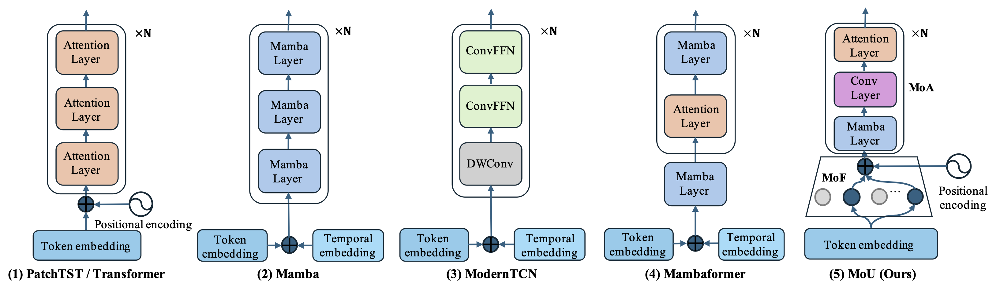

# MoU
This is the implementation of paper: Mamba or Transformer for Time Series Forecasting? Mixture of Universals (MoU) Is All You Need.

## Our Paper
We introduce a new versatile model **Mixture of Universals (MoU)** to capture both short-term and long-term dynamics for enhancing perfomance in time series forecasting. MoU is composed of two novel designs: Mixture of Feature Extractors (MoF), an adaptive method designed to improve time series patch representations for short-term dependency, and Mixture of Architectures (MoA), which hierarchically integrates Mamba, FeedForward, Convolution, and Self-Attention architectures in a specialized order to model long-term dependency from a hybrid perspective. The proposed approach achieves state-of-the-art performance while maintaining relatively low computational costs. 

## Model Structure
The overview of MoU is dispalyed as follows:


Specifically, MoU is consist of MoF for short-term dependecy modeling and MoA for long-term dependecy modeling. 

MoF is designed to capture divergent context information for better short-term dependency modeling. The structure of MoF is dispalyed as follows:


The architecture of MoA is designed to hierarchically model long-term dependencies by progressively expanding its receptive fields. This approach facilitates the formation of a comprehensive representation of long-term dependencies. The structure of MoA is dispalyed as follows:


## Model Efficiency Comparison
We compare the training time and memory used of MoU with other baseline models. The results are as follows:


## Main Result

MoU achieves state-of-art permance in comparision with other baseline models for time series long-term forecasting. The results are shown as follows:


## Preparation
Install Python 3.8 and necessary dependencies.
```pip
pip install -r requirements.txt
```
Download datasets to folder "dataset". You can download all datasets from [Google Drive](https://drive.google.com/drive/folders/1ZOYpTUa82_jCcxIdTmyr0LXQfvaM9vIy) provided by [Wu, H.](https://github.com/thuml/Autoformer?tab=readme)
```bash
mkdir dataset
```

## Run

Run bash scripts in folder "scripts" to start time series long-term forecasting. For example,
```bash
bash scripts/MoU/etth1.sh

bash scripts/MoU/etth2.sh

bash scripts/MoU/ettm1.sh

bash scripts/MoU/ettm2.sh

bash scripts/MoU/weather.sh

bash scripts/MoU/electricity.sh

bash scripts/MoU/illness.sh
```
